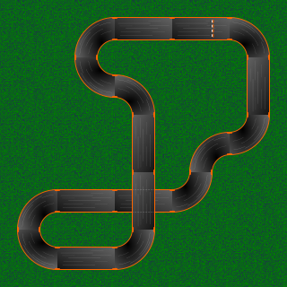

# AnkiNodeDrive
Anki Overdrive SDK using Node and BTLE 
 
This emulates much of what can be found in the default Anki Drive SDK: 
<a href='http://developer.anki.com/drive-sdk/'>http://developer.anki.com/drive-sdk/</a>
 
This example shows similar capabilities using NodeJS. 
 
Full documentation can be found in the apidoc/index.html; which is automatically served by the nodeJS server at '/'. 
<h2>Running</h2>
There is a run.sh to show how to run the server using a specific BLTE device.  I run this on a PI3 with built-in BLTE.  If you only have one BLTE device, node server.js should be enough.  You will likely need to do an npm install first to gather any dependencies.
<h2>Basic capabilities</h2>
See the apidoc for full api documentation.  There are some APIs, such as set-sdk, connect, etc, which happen automatically, so you don't need to worry about them.  For example, when you call "setSpeed", if the server is not connected to a car yet, it will automatically do a connect and turn on sdk mode. Also, logging is turned off by default, so you won't see messages from the car unless you explicitly call the 'turnOnLogging' service. 

Here is a basic list of capabilities: 
<b>COMMUNICATIONS</b>
<ul>
<li>batteryLevel</li>
<li>connect</li>
<li>disconnect</li>
<li>getDevices</li>
<li>ping</li>
<li>rescan</li>
<li>turnOnLogging</li>
</ul>
<b>DRIVE</b>
<ul>
<li>changeLanes</li>
<li>setLaneOffset</li>
<li>setSpeed</li>
<li>trackCountTravel</li>
</ul>
<b>LIGHTS</b>
<ul>
<li>flashTaillights</li>
<li>setEngineLight</li>
<li>turnOffHeadlights</li>
<li>turnOffTaillights</li>
<li>turnOnHeadlights</li>
<li>turnOnTaillights</li>
</ul>
<b>MAPPING</b>
<ul>
<li>getTrackMap</li>
<li>getTrackMapData</li>
<li>mapTrack</li>
</ul>
 
<h2>Example map generated</h2>

<h2>Known Limitations</h2>
I was only able to sort out the track IDs for my kit.  I have a few other kits on order and will update the track IDs as best I can.  Please let me know if you are able to tell me additional track IDs and what type of track it is (straight/curve/start). 
 
The lights APIs were not easy to figure out.  I believe they changed quite a bit in the Overdrive version and the public SDK does not address the changes yet.  I did my best to handle a few cases.  If you sort out others, let me know. 
 
I began to work on being able to build a map of the track, but this is not yet complete.  My thinking was to expose two services: 
/mapTrack/:carname - This would drive the given car at a slow pace (300) and capture each track ID from start to finish building a track map array. 
/getMap - Get the resulting map array which could be used to generate an image. 
/getMapImage - Perhaps auto generate a png/gif of the track. TBD 
